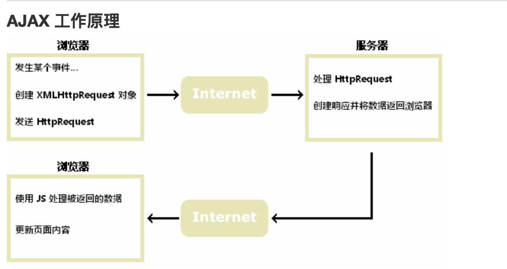
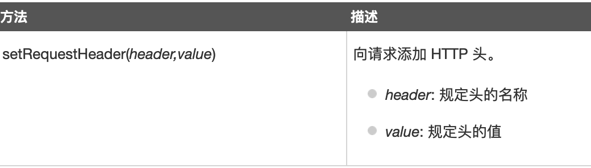
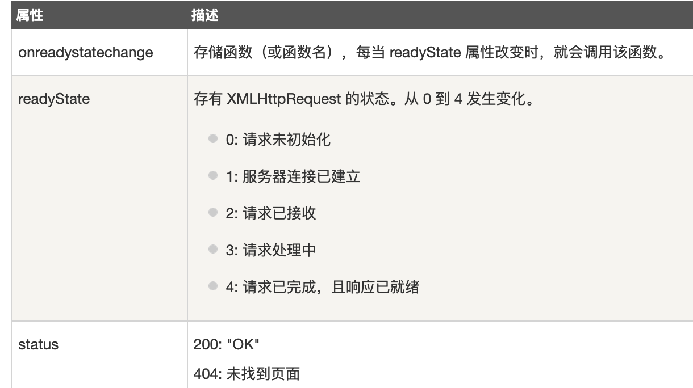

## 认识 ajax

Ajax 等于异步 js 和 XML

不是一个编程语言，是一种使用现有标准的方法

最大的优点就是不需要重新加载整个页面，可以与服务器交换数据并更新部分页面内容。




## 创建 XMLHTTPRequest对象

XMLHttpRequest 是 Ajax 的基础。

创建 XMLHttpRequest 对象语法

为了应对所有的现代浏览器，包括 IE5、IE6，所以要检查浏览器是否支持XMLHttpRequest，如果不支持就创建ActiveXObject。

例子：

```javaScript
var xmlhttp; 
if (window.XMLHttpRequest)
 { 
// IE7+, Firefox, Chrome, Opera, Safari 浏览器执行代码 
xmlhttp=new XMLHttpRequest(); 
} 
else 
{ 
// IE6, IE5 浏览器执行代码 
xmlhttp=new ActiveXObject("Microsoft.XMLHTTP"); 
}
```


## 向服务器发送请求

XMLHttpRequest 对象用于和服务器交换数据。

用到的方法：open() 和 send()

```javascript
xmlhttp.open("GET","ajax_info.txt",true);
xmlhttp.send();
```


#### 重点：**GET 和 POST 方法的区别：**

**1、发送的数据数量**

在 GET 中，只能发送有限数量的数据，因为数据是在 URL 中发送的。

在 POST 中，可以发送大量的数据，因为数据是在正文主体中发送的。

**2、安全性**

GET 方法发送的数据不受保护，因为数据在 URL 栏中公开，这增加了漏洞和黑客攻击的风险。

POST 方法发送的数据是安全的，因为数据未在 URL 栏中公开，还可以在其中使用多种编码技术，这使其具有弹性。

**3、加入书签中**

GET 查询的结果可以加入书签中，因为它以 URL 的形式存在；而 POST 查询的结果无法加入书签中。

**4、编码**

在表单中使用 GET 方法时，数据类型中只接受 ASCII 字符。

在表单提交时，POST 方法不绑定表单数据类型，并允许二进制和 ASCII 字符。

**5、可变大小**

GET 方法中的可变大小约为 2000 个字符。

POST 方法最多允许 8 Mb 的可变大小。

**6、缓存**

GET 方法的数据是可缓存的，而 POST 方法的数据是无法缓存的。

**7、主要作用**

GET 方法主要用于获取信息。而 POST 方法主要用于更新数据。

get（）和 post（）

两种在客户端和服务器端进行请求-响应的常用方法是：GET 和 POST。

- *GET* - 从指定的资源请求数据
- *POST* - 向指定的资源提交要处理的数据

如果需要像 HTML 表单那样 POST 数据，请使用 setRequestHeader() 来添加 HTTP 头。然后在 send() 方法中规定您希望发送的数据：

```javascript
xmlhttp.open("POST","/try/ajax/demo_post2.php",true); 
xmlhttp.setRequestHeader("Content-type","application/x-www-form-urlencoded");
xmlhttp.send("fname=Henry&lname=Ford");
```




## 服务器响应

如需获得来自服务器的响应，请使用 XMLHttpRequest 对象的 responseText 或 responseXML 属性。


如果来自服务器的响应并非 XML，请使用 responseText 属性。

如果来自服务器的响应是 XML，而且需要作为 XML 对象进行解析，请使用 responseXML 属性。


## ajax onreadystatechange 事件



在 onreadystatechange 事件中，我们规定当服务器响应已做好被处理的准备时所执行的任务。

当 readyState 等于 4 且状态为 200 时，表示响应已就绪。

```javascript
xmlhttp.onreadystatechange=function() 
{ if (xmlhttp.readyState==4 && xmlhttp.status==200)
 { 
document.getElementById("myDiv").innerHTML=xmlhttp.responseText;
 } 
}
```


## ajax get 封装

在 HTML 文件中引用 js 文件，js 文件用于封装方法，在 HTML 文件中直接使用方法，注意 IE 浏览器的兼容问题。

#### HTML 文件中：

1、引用 js 文件

2、通过绑定 button 的点击事件，使用ajax方法（js 文件里面定义的方法）

3、body 中添加按钮标签


#### js 文件：

1、obj2str 方法：处理 ajax 方法中的 obj  主要是通过遍历的方式，将实参 obj 对象转换为字符串

注意点：浏览器发送请求时不能包含中文，需要转化格式，需要使用 encodeURIComponent 方法

需要在生成的字符串中通过&连接，所以在末尾添加 join 方法来添加&

2、ajax 方法：参数：

url：需要引用php文件的路径或者是文件名

obj：需要传入的对象

timeout：定义一个请求超时的数字

success：请求成功会触发的函数

error：请求失败会触发的函数


步骤：

​	0、将对象转化为字符串

​	1、创建一个异步对象（需要兼容浏览器）

​	2、设置请求方式和请求地址

​	3、发送请求

​	4、监听请求的变化（状态的变化）	
​        0：请求未初始化
   		1：服务器连接已建立
​    	 2：请求已接收
​        3：请求处理中
​        4：请求已完成，且响应已就绪


最后的末尾 设置定时器来处理请求超时事件

php 文件：

使用 $_GET 方法


## ajax post

直接在 HTML 文件中添加事件请求方法，还是注意浏览器的兼容性，还有POST 需要在 open 和 send 方法之间添加setRequestHeader 方法，post 方法需要在 send 方法中添加  请求对象


## cookie

cookie：回话跟踪技术 客户端

session：会话跟踪技术 服务端

cookie 作用：

将网页中的数据保存到浏览器中

cookie 生命周期：

默认情况下，生命周期是一次会话（浏览器被关闭）

如果通过 expires= 设置了过期时间，并且过期时间没有过期，那么下次打开浏览器还是存在

如果通过 expires设置了过期时间，并且过期时间已经过期，那么会立即删除保存的数据

cookie 注意点：

cookie 默认不会保存任何的数据

cookie 不能一次性设置多条数据，想要保存多条数据，只能一条一条的设置

cookie 有大小和个数的限制：

个数限制：20~50

大小限制：4kb 左右

cookie 作用范围：

同一个浏览器的同一个路径下访问

同一个浏览器的下一级路径也可以访问

如果想要在同一个浏览器中，上一级目录也可以访问到保存的 cookie，那么需要添加一个 path 属性，path=/
