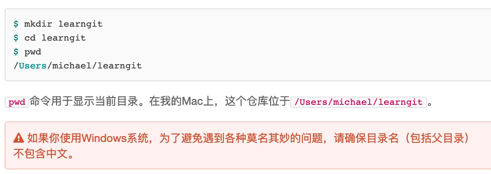

 创建版本库

git是分布式版本控制系统

和集中式版本控制系统相比，分布式版本控制系统的安全性更高。

创建一个版本库：创建一个新目录：

第二步，通过 git init命令把这个目录变成git可以管理的仓库

git init

可以看到一个.git目录，一般是隐藏的，用ls -ah命令就可以看见

编写一个readme.txt文件：

vi readme.txt

进入一个编写环境

退出方式：esc   shift+“；” （也就是冒号）wq（保存并退出）

用命令git add 告诉git，把文件添加仓库：

git add readme.txt

无反应，则添加成功

用命令git commit告诉git 提交到仓库：

git commit -m "wrote a readme file"

-m后面输入的是本次提交的说明，可以输入任意内容

小结：

初始化一个Git仓库，使用git init命令。

添加文件到Git仓库，分两步：

1. 使用命令git add <file>，注意，可反复多次使用，添加多个文件；
2. 使用命令git commit -m <message> 完成。

