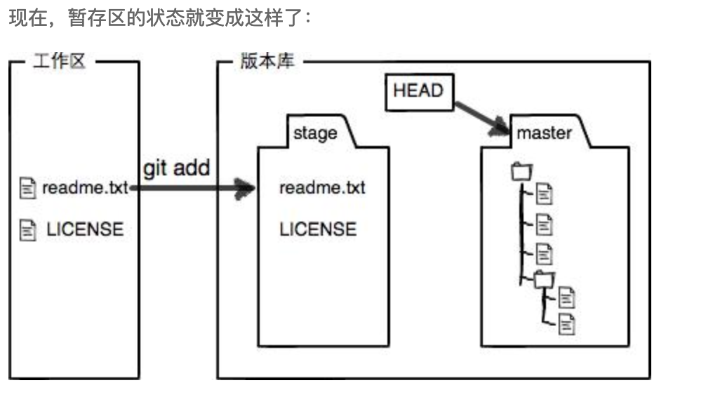
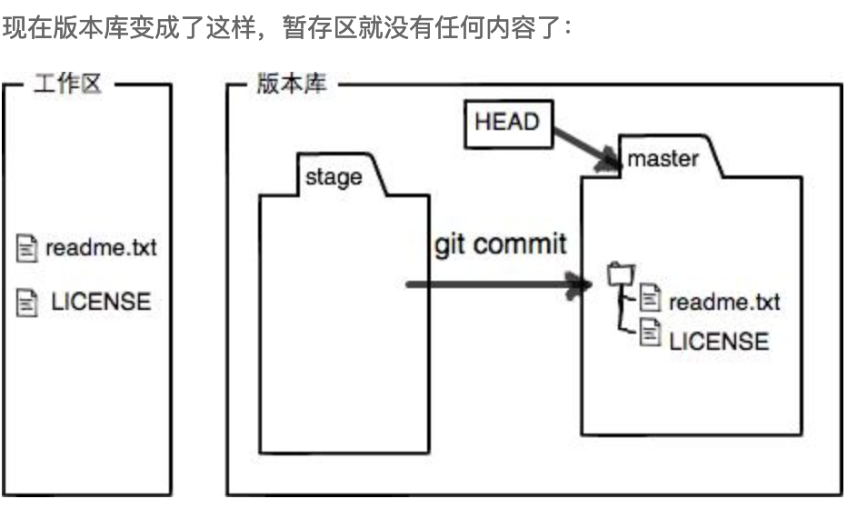

工作区 working directory

就是电脑看到的文件夹目录

版本库 repository

工作区有一个隐藏的目录 .git  是git 的版本库

版本库里面存很多东西，最重要的是 stage（或者是index）的暂存区。

Git为我们自动创建的第一个分支master，以及指向master的一个指针叫HEAD。

前面讲了我们把文件往Git版本库里添加的时候，是分两步执行的：

第一步是用git add把文件添加进去，实际上就是把文件修改添加到暂存区；

第二步是用git commit提交更改，实际上就是把暂存区的所有内容提交到当前分支。

因为我们创建Git版本库时，Git自动为我们创建了唯一一个master分支，所以，现在，git commit就是往master分支上提交更改。

你可以简单理解为，需要提交的文件修改通通放到暂存区，然后，一次性提交暂存区的所有修改。

修改readme.txt 新增一个license

使用 git add

使用git commit

