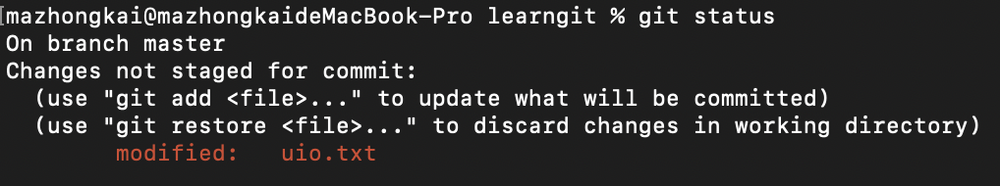

## 管理修改 撤销修改

#### 管理修改

经过两次修改，第一次修改之后使用 git add 将文件从工作区存放到版本库里面的暂存区，第二次修改之后直接使用 git commit 出现的结果是 只有第一次修改的文件提交了。

经过两次修改，第一次修改之后使用 git add 将文件从工作区存放到版本库里面的暂存区，第二次修改之后也使用git add 将文件放入暂存区，再使用一个git commit提交。

**小结**

现在，你又理解了Git是如何跟踪修改的，每次修改，如果不用git add到暂存区，那就不会加入到commit中。

撤销修改(不同系统有不同的撤销语法）这里的前提都是在版本库里面已经有文件了（也就是已经有过一次git commit）

#### 撤销修改

(不同系统有不同的撤销语法）这里的前提都是在版本库里面已经有文件了（也就是已经有过一次git commit）

mac：

场景一：当你在工作区修改错误，想要回复到和版本号中一样的，使用 `git restore xxx`

场景二：将修改错误的文件git add之后放到了暂存区，可以使用 `git restore --staged file...`  (to unstage意思是把暂存区的修改撤销掉，重新放回工作区),然后再使用场景一中的方法修改回复

场景三：已经把错误的文件提交了，但是想要撤销，参考版本回退，不过前提是没有推送到远程库。

##### 删除文件：

(以下是mac版本的操作）

一般情况下，你通常直接在文件管理器中没用的文件删了，或者用 rm 命令删了。

`rm xxx`

这个时候，git收到了你删除文件的信号，工作区和版本库就不一致了，git status命令立刻告诉你哪些文件被删除了

现在有两个选择，一是确定从版本库中删除该文件，使用 `git rm file`删除，并且使用 

`git commit   -m"remove xxx"`  现在文件从版本库中被删除

特殊情况：当你手动在文件夹中删除了文件，你使用 git add/git rm的效果都是一样的，都是删除。（下面的截图是使用git add的情况，显示的结果还是delete ）

另一种情况是删错了，需要恢复，从版本库里面把误删的文件恢复到最新版本：

`git checkout -- file`

在mac中：`git restore file`就可以了

注意：从来没有添加到版本库里就被删除的文件无法恢复。

**小结**

命令git rm用于删除一个文件。如果一个文件已经被提交到版本库，那么你永远不用担心误删，但是要小心，你只能恢复文件到最新版本，你会丢失**最近一次提交后你修改的内容**。

