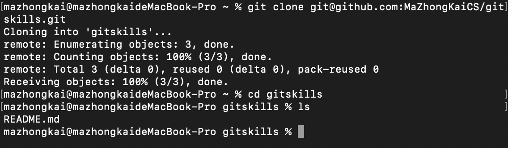
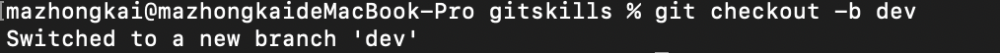
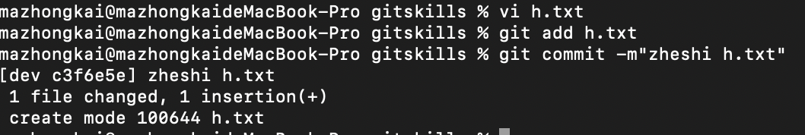
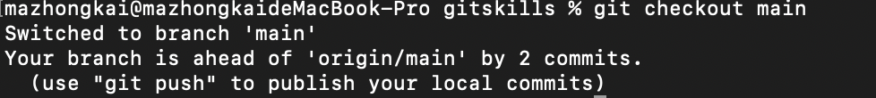
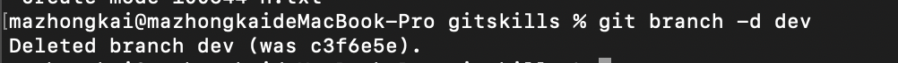
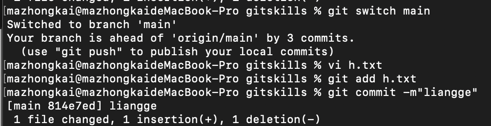
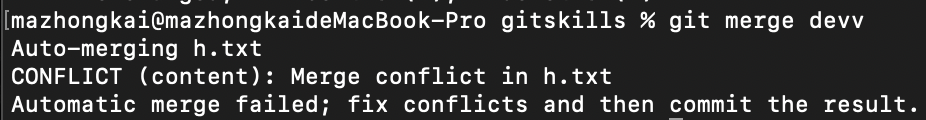

 

## 远程仓库

检查现有SSH密钥：https://docs.github.com/cn/github/authenticating-to-github/checking-for-existing-ssh-keys

生成新 SSH 密钥并添加到 ssh-agent：https://docs.github.com/cn/github/authenticating-to-github/generating-a-new-ssh-key-and-adding-it-to-the-ssh-agent

新增SSH密钥到GitHub账户：https://docs.github.com/cn/github/authenticating-to-github/adding-a-new-ssh-key-to-your-github-account

**小结(在github里面可以看到命令提示）**

要关联一个远程库，使用命令

```nginx
git remote add origin git@server-name:path/repo-name.git；
```

关联后，使用命令```git push -u origin main``` 第一次推送master分支的所有内容；

此后，每次本地提交后，只要有必要，就可以使用命令```git push origin master```推送最新修改；

克隆远程仓库



**小结**

要克隆一个仓库，首先必须知道仓库的地址，然后使用```git clone```命令克隆。

Git支持多种协议，包括https，但ssh协议速度最快


## 分支管理 创建合并分支

一开始HEAD  指针指向的是main，也就是主分支。HEAD指向的是当前分支。而main才是指向提交的。

我们创建一个新的分支dev，指向跟main相同的提交，再把HEAD的指针指向dev（也就是分支）。现在对工作区的修改和提交都是针对dev分支，提交一次，dev指针往前一次，而main的指针不动。dev工作完成之后，就可以把dev和main合并，方法就是将main的指针指向dev当前的提交，完成合并。然后可以删除dev。

实战：

首先创建分支dev，两种方式：

```git checkout -b dev```



相当于：

```git branch dev```

```git checkuot dev```

还有一种方式 也是更科学的方式：

创建并切换到新的dev分支：```git switch -c dev```

直接切换到已有的分支，常用在main上：```git switch main```

然后，用git branch查看当前分支：当前分支前面有*


然后，对分支上的文件进行一次修改，并且提交



然后，把指针指向main：

`git checkout main/git switch main`



但是因为没有合并，所以没能看到dev上面的修改，我们进行合并：

`git merge dev`

gitmerge命令用于合并指定分支到当前分支。


合并之后就可以放心删除dev分支

`git branch -d dev`




**小结**

Git鼓励大量使用分支：

查看分支：`git branch`

创建分支：`git branch <name>`

切换分支：`git checkout <name>`或者 `git switch <name>`

创建+切换分支：`git checkout -b <name>`或者`git switch -c <name>`

合并某分支到当前分支：`git merge <name>`

删除分支：`git branch -d <name>`


## 解决冲突

我们创建一个devv分支，在上面修改并且提交了文件


然后，将指针指向main分支，也修改了文件（相同位置不同内容）



在合并分支时，报错，git告诉我们文件冲突，需要手动解决



直接进入文件修改并提交（git add 和 git commit)，之后查看分支合并情况：


最后删除分支devv。

git branch -d devv

**小结**

当Git无法自动合并分支时，就必须首先解决冲突。解决冲突后，再提交，合并完成。

解决冲突就是把Git合并失败的文件手动编辑为我们希望的内容，再提交。

用git log --graph命令可以看到分支合并图。


