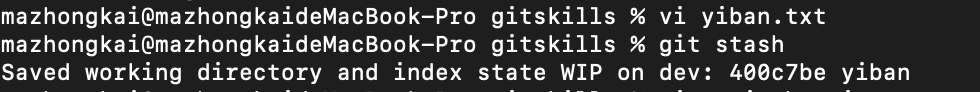
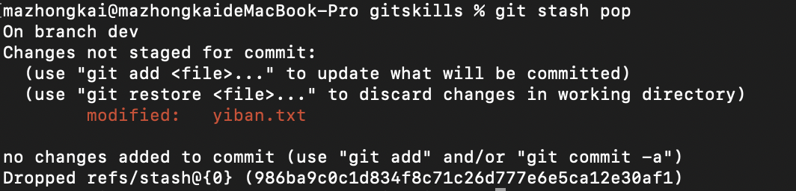
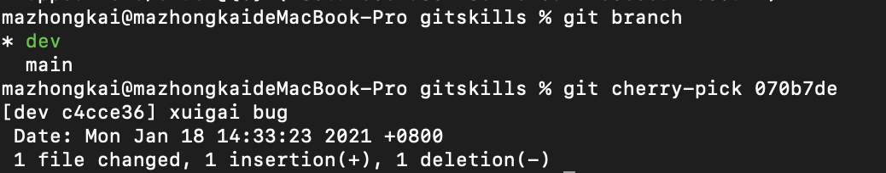

 

## 合并策略 bug 分支 feature 分支

一般情况下，Git会用Fast forward模式，但这种模式下，删除分支后，会丢掉分支信息，使用 `git log --graph` 看不到被删除的分支。一般普通的合并模式需要取消Fast forward模式。

使用 git merge --no-ff，如果要强制禁用Fast forward模式，Git就会在merge时生成一个新的commit，这样，从分支历史上就可以看出分支信息。因为生成了一个新的commit，所以需要-m"xxx"来描述一次。

`git merge --no-ff -m "merge with no-ff" dev`

然后使用 `git log --graph` 就可以看到历史分支的信息。

小结：

Git分支十分强大，在团队开发中应该充分应用。

合并分支时，加上`--no-ff`参数就可以用普通模式合并，合并后的历史有分支，能看出来曾经做过合并，而fast forward合并就看不出来曾经做过合并。

bug分支：

当我们在分支dev工作时，main主分支上有个bug需要及时处理，我们可以在main创建一个新的bug分支用来修复bug。

首先我们暂停手上的工作，将完成一半的文件保存起来：

Git还提供了一个stash功能，可以把当前工作现场“储藏”起来，等以后恢复现场后继续工作

git stash。

然后切换到main上创建一个新的修补bug的分支并且在上面修改bug，然后提交，提交后记住commit id，后面需要用到：

然后，切换到main，然后合并分支，然后删除临时分支；

修复完bug之后回到dev分支完成之前一半的工作：

恢复保存起来的文件：

首先查看：

然后工作现场还在，Git把stash内容存在某个地方了，但是需要恢复一下，有两个办法：

一是用`git stash apply`恢复，但是恢复后，stash内容并不删除，你需要用`git stash drop`来删除；

 可以使用 `git stash apply stash@{0}` 来恢复指定的文件。

另一种方式是用git stash pop，恢复的同时把stash内容也删了：

有一个关键点：修复了main的bug，而dev也是main的分支，所以dev上面依然存在bug，而工作没有完成不能合并，同样的bug，要在dev上修复，我们只需要把`070b7de xuigai bug`这个提交所做的修改“复制”到dev分支。注意：我们只想复制`070b7de xuigai bug`这个提交所做的修改，并不是把整个master分支merge过来。

为了方便操作，Git专门提供了一个cherry-pick命令，让我们能复制一个特定的提交到当前分支：首先确认现在指针的位置是不是dev，然后开始复制特定的修改。

小结：

修复bug时，我们会通过创建新的bug分支进行修复，然后合并，最后删除；

当手头工作没有完成时，先把工作现场git stash一下，然后去修复bug，修复后，再`git stash pop`，回到工作现场；

在master分支上修复的bug，想要合并到当前dev分支，可以用`git cherry-pick <commit>`命令，把bug提交的修改“复制”到当前分支，避免重复劳动。

feature分支：

开发一个新feature，最好新建一个分支；

由于保密原因，必须删除一个刚刚完成的文件，如果要丢弃一个没有被合并过的分支，可以通过`git branch -D <name>`强行删除

