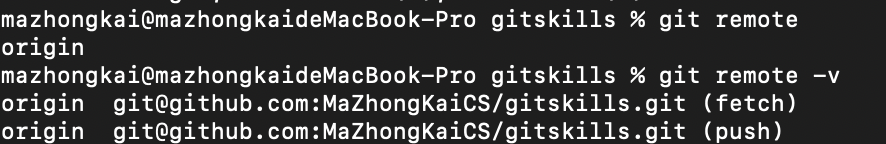
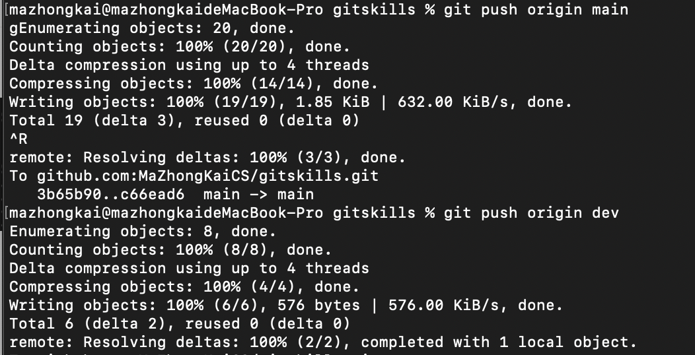

## 多人协作

远程仓库的默认名称是origin

推送分支：我的主分支是main   但是其他系统看到的master。

要将main主分支或者是分支dev推送到远程仓库：

`git push origin xxx`

模拟一个你的小伙伴，可以在另一台电脑（注意要把SSH Key添加到GitHub）或者同一台电脑的另一个目录下克隆：

我的情况：克隆了gitskills文件，需要进入克隆的文件才可以进行分支管理的操作！

因此，多人协作的工作模式通常是这样：

   首先，可以试图用`git push origin <branch-name>`推送自己的修改；

   如果推送失败，则因为远程分支比你的本地更新，需要先用git pull试图合并；

   如果合并有冲突，则解决冲突，并在本地提交；

   没有冲突或者解决掉冲突后，再用`git push origin <branch-name>`推送就能成功！

如果git pull提示no tracking information，则说明本地分支和远程分支的链接关系没有创建，用命令`git branch --set-upstream-to <branch-name> origin/<branch-name>`

**小结**

- 查看远程库信息，使用`git remote -v`；
- 本地新建的分支如果不推送到远程，对其他人就是不可见的；
- 从本地推送分支，使用`git push origin branch-name`，如果推送失败，先用`git pull`抓取远程的新提交；
- 在本地创建和远程分支对应的分支，使用`git checkout -b branch-name origin/branch-name`，本地和远程分支的名称最好一致；
- 建立本地分支和远程分支的关联，使用`git branch --set-upstream branch-name origin/branch-name`；
- 从远程抓取分支，使用`git pull`，如果有冲突，要先处理冲突。

