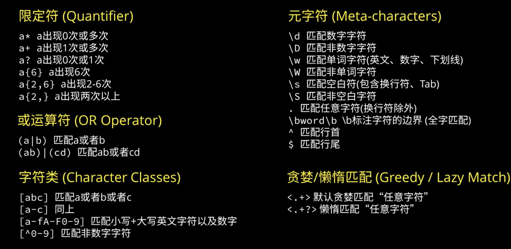

限定符：

？：？前面的字符需要出现 0 次或者 1 次（可有可无）

\*  ：*  前面的字符可以没有也可以出现多次

\+ ： + 会匹配出现一次以上的字符

{} :  匹配前面的字符出现的次数，

{n}，代表出现n 次

{n,m},代表出现 n 次到 m 次

{n, }，代表出现 n 次或者n 次以上

以上是对于限定符前面一个字符，如果想要匹配更多的字符，可以将字符用（）括起来

运算符：

|  :  或类，括号不能少（cat | dog），cat 或 dog 都符合

[] : 字符类，方括号中的内容代表要求匹配的字符只能取自于它们，可以在【】中规定范围：

[a-z]：所有的小写字母字符

[A-Z]：所有的大写字母字符

[a-zA-Z]：所有的字母字符

[a-zA-Z0-9]：所有的字母和数字字符

[^0-9]：所有的非数字字符（包括换行符）

元字符：（定义好的规则）

\d: 数字字符  等同于[0-9]

\D：非数字字符  等同于[^0-9]

\w: 单词字符（英文，数字以及下划线）

\W: 非单词字符

\s：空白符（包含 Tab 和换行符）

\S: 非空白字符

. : 代表任意字符（但不包含换行符）

^：只会匹配行首的字符  ^a 只会匹配行首的 a

$: 只会匹配行尾字符     a$  只会匹配行尾的 a

